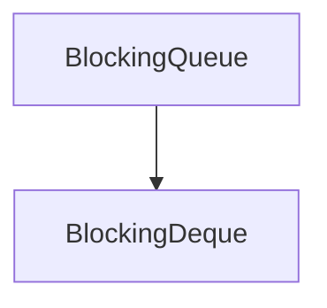

# JUC学习笔记

> 开个坑，希望能填完

## Interface

### [BlockingQueue\<E>](https://docs.oracle.com/javase/7/docs/api/java/util/concurrent/BlockingQueue.html)

> A Queue that additionally supports operations that wait for the queue to become non-empty when retrieving an element, and wait for space to become available in the queue when storing an element.

一个Queue，额外添加如下功能

- 等待Queue非空去移除一个元素
- 等待Queue非满去添加一个元素

#### attention

- 关于空值null
  - 无法添加空值，会抛出NullPointerException
  - poll失败时会返回空值
- 元素数量可能会有最大值，在没有设定最大值时，总会返回Integer.MAX_VALUE
- 该接口主要解决producer-consumer问题，虽然可以移除任意元素，但效率堪忧
- 对于Collection大部分方法线程安全，除去addAll、removeAll、containsAll、retainAll
- 没有中断操作，该操作需具体实现

#### method

|         | Throw exception | Special value | Blocks | Times out |
| ------- | --------------- | ------------- | ------ | --------- |
| insert  | add             | offer         | put    | offer     |
| remove  | remove          | poll          | take   | poll      |
| examine | element         | peak          |        |           |

- add

  在不超过容量限制的情况下马上插入一个元素，成功返回true，失败抛出异常

- offer

  在不超过容量限制的情况下马上插入一个元素，成功返回true，失败返回false

  如果参数中给定时间，则会在无法插入时最多等待给定时间。

- put

  插入元素，但当容量已满时会阻塞当前线程直到容量不满

- poll

  取出头元素元素并返回，成功返回该元素，失败返回null

  如果参数中给定时间，则会在无法取出时最多等待给定时间

- remove

  如果存在，则移除

- take

  取出头元素并返回，如果不存在则会阻塞当前线程直到有可用元素

- remainingCapacity

  在判断容量时使用，如果未设定返回Integer.MAX_VALUE

### BlockingDeque\<E>

基本等同于[BlockingQueue\<E>](#BlockingQueue\<E>)，只不过换为了队列

#### attention

一般情况下等同于FIFO的BlockingQueue，但是在多线程中拥有顺序的执行顺序更适用。

####　method

在头尾各有一套存取测试函数。